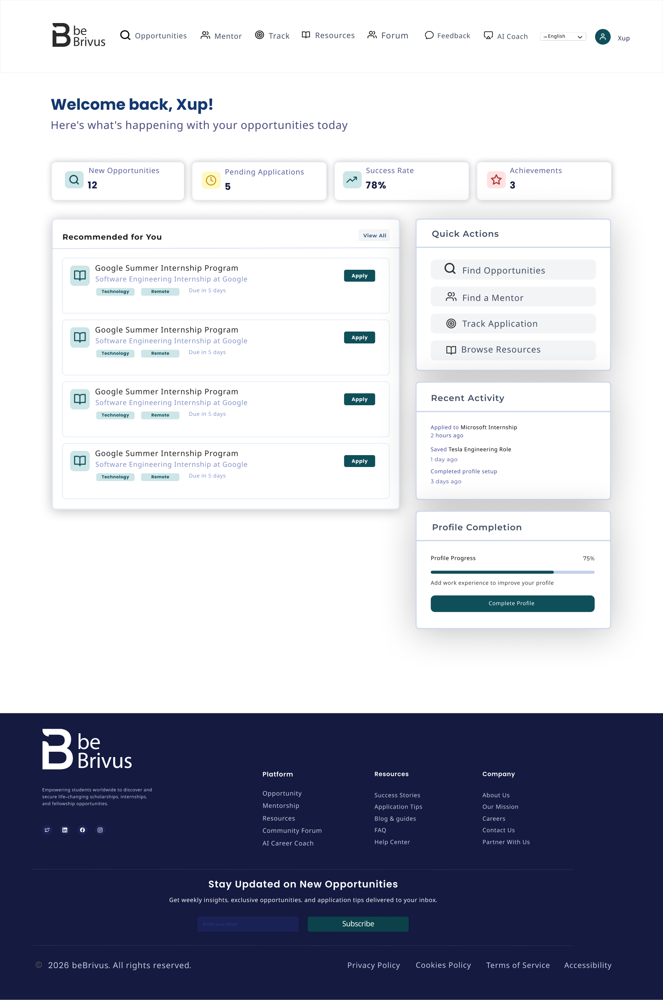
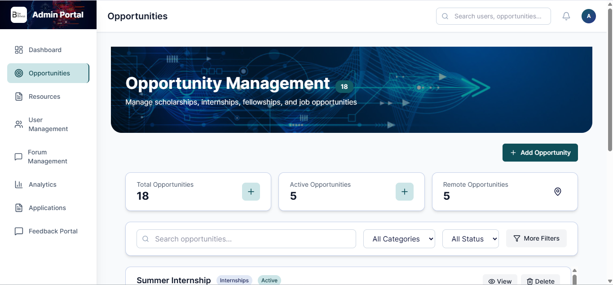
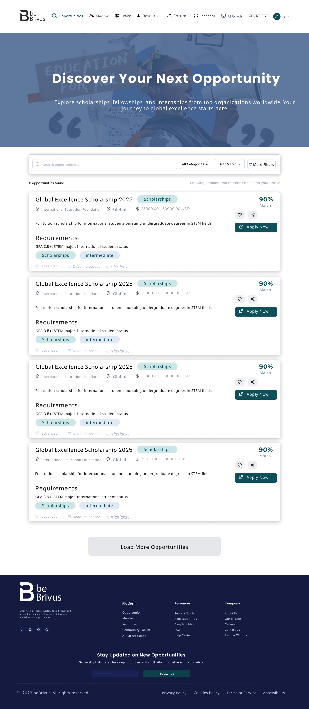
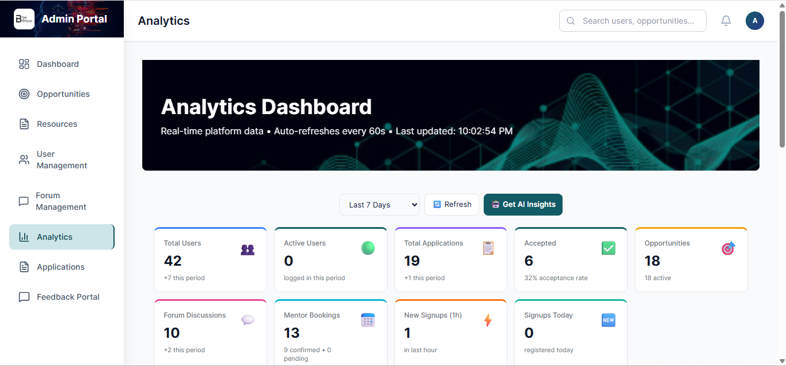

# beBrivus

beBrivus is a platform that helps African students discover opportunities, manage applications, and access mentorship and learning support in one product.

The project combines a React frontend and a Django backend, with background workers for asynchronous processing, AI-assisted workflows, multilingual support, and role-based dashboards for students, institutions, and administrators.

## 1. Project Scope

beBrivus is designed around three user groups:

- Students: discover opportunities, track applications, engage in community discussions, and request mentorship support.
- Institutions: publish opportunities, receive applications, and manage applicant pipelines.
- Administrators: govern content, moderate discussions, monitor activity, and maintain platform quality.

Core product goals:

- Improve access to scholarships, internships, grants, and training programs.
- Reduce missed deadlines with structured tracking and notifications.
- Provide practical support through mentorship, resources, and AI guidance.
- Ensure broad accessibility through multilingual and offline-capable experience.

## 2. Demo & Design

### Live Demo
- **Application URL**: [(https://bebrivus.com)]
- **Demo Credentials**: [(https://drive.google.com/file/d/1v-CvAC4l6qrhcJUAuSOdp9d-DgHP_RsP/view?usp=drivesdk)]

### Design Assets
- **Figma Design**: [[https://www.figma.com](https://www.figma.com/design/CNoGWFBj59n4JHGY4oVd0X/beBrivus-Capstone-Figma-Design?node-id=4567-271&p=f)]
- **Design Includes**:
  - Student dashboard wireframes
  - Institution portal layouts
  - Admin panel interface designs
  - Mobile responsive views
  - Component library and design tokens
  - User flow diagrams

### Screenshots

**Student Dashboard**


**Admin Panel**


**Opportunity Management**


**Analytics Dashboard**


## 3. Core Capabilities

### Student Experience

- Opportunity discovery with search and filtering.
- Personal application tracking and progress monitoring.
- Self-service account deletion from profile settings with confirmation and secure sign-out flow.
- Feedback form submission with acknowledgment and support follow-up workflow.
- Mentor discovery, booking, and communication.
- Direct messaging with mentors, institutions, and other users for personalized support and communication.
- Community forum participation.
- Resource library access.
- AI-assisted support for guidance and moderation-related features.
- Notification-driven reminders and updates.
- Access to Privacy Policy, Terms of Service, Cookie Policy, and Accessibility pages.

### Institution Experience

- Opportunity publishing and lifecycle management.
- Application intake and review workflows.
- Direct messaging with applicants and mentors for streamlined communication.
- Candidate communication support.
- Organization-facing dashboard tools.

### Administrative Experience

- User and role management.
- Forum and content moderation.
- Oversight of opportunities and resources.
- Platform analytics and operational visibility.
- Feedback intake/review workflows and response tracking for user-submitted issues.

## 4. Architecture

High-level architecture:

- Frontend: React + TypeScript SPA served by Vite in development.
- Backend: Django + Django REST Framework.
- Realtime/async: Channels and Celery workers.
- Queue/cache: Redis.
- Database: SQLite in local development, with migration path to PostgreSQL for production.

Repository layout:

```text
beBrivus-Mission-Capstone/
  backend/
    apps/
      accounts/
      ai_services/
      analytics/
      applications/
      feedback/
      forum/
      gamification/
      mentors/
      messaging/
      notifications/
      opportunities/
      resources/
      tracker/
      video/
    core/
    manage.py
    requirements.txt
  frontend/
    src/
    public/
    package.json
  README.md
```

## 5. Technology Stack

Frontend:

- React, TypeScript, Vite
- TanStack Query
- React Router
- i18next
- Tailwind CSS
- Axios

Backend:

- Django
- Django REST Framework
- Django Channels
- Celery
- Redis
- Django Simple JWT
- Google Gemini integration (AI services)

## 6. Local Development Setup

### Prerequisites

- Node.js 18+
- Python 3.10+
- Git
- Redis (for Celery/Channels features)

### Backend setup

```bash
cd backend
python -m venv .venv

# Windows
.venv\Scripts\activate

# macOS/Linux
# source .venv/bin/activate

pip install -r requirements.txt
python manage.py migrate
python manage.py createsuperuser
python manage.py runserver 0.0.0.0:8001
```

### Frontend setup

```bash
cd frontend
npm install
npm run dev
```

### Optional background worker setup

Run these in separate terminals when needed:

```bash
cd backend
celery -A core worker --loglevel=info
```

## 7. Environment Configuration

Create `backend/.env` and set values like the following:

```env
SECRET_KEY=your-django-secret-key
DEBUG=True
ALLOWED_HOSTS=localhost,127.0.0.1

DB_ENGINE=django.db.backends.sqlite3
DB_NAME=db.sqlite3

EMAIL_BACKEND=django.core.mail.backends.smtp.EmailBackend
EMAIL_HOST=smtp.gmail.com
EMAIL_PORT=587
EMAIL_USE_TLS=True
EMAIL_HOST_USER=your-email@example.com
EMAIL_HOST_PASSWORD=your-app-password

GEMINI_API_KEY=your-gemini-api-key

REDIS_URL=redis://localhost:6379/0
CORS_ALLOWED_ORIGINS=http://localhost:5173,http://127.0.0.1:5173
```

Optional frontend `.env`:

```env
VITE_API_BASE_URL=http://localhost:8001/api
```

## 8. Localization and Accessibility

The platform includes multilingual support for major African language contexts and international usage. Language state is persisted on the client, and UI rendering includes support for language-specific layout behavior where required.

## 9. Offline and PWA Behavior

The frontend includes progressive web app support with caching and offline-oriented behavior for selected assets and previously loaded content.

## 10. Testing and Quality Checks

Backend checks:

```bash
cd backend
python manage.py check
python manage.py test
```

Frontend checks:

```bash
cd frontend
npm run lint
npm run build
```

## 11. API Surface (Summary)

The backend exposes REST endpoints under `/api/` for:

- authentication and profile management
- opportunities and applications
- mentoring and booking
- forum, AI coaching, and moderation
- resources
- analytics and administration

Refer to app-specific views/serializers in `backend/apps/` for implementation-level endpoint details.

## 12. Deployment Notes

The repository contains deployment-oriented assets and scripts (for example, service files and compose configuration) to support server-based deployments.

Minimum production recommendations:

- move from SQLite to PostgreSQL
- use secure secret management and rotate credentials
- run with `DEBUG=False`
- configure strict host/CORS policies
- run asynchronous workers and Redis in managed services where possible

## 13. Security Guidance

- Do not commit runtime secrets (`.env`, app passwords, API keys, production credentials).
- Keep sensitive files ignored in `.gitignore`.
- If a secret is exposed, rotate it immediately and remove it from repository history if necessary.

## 14. License

This project is licensed under the MIT License.

## 15. Maintainers

Project ownership and contributor details can be maintained in this section as the team evolves.
